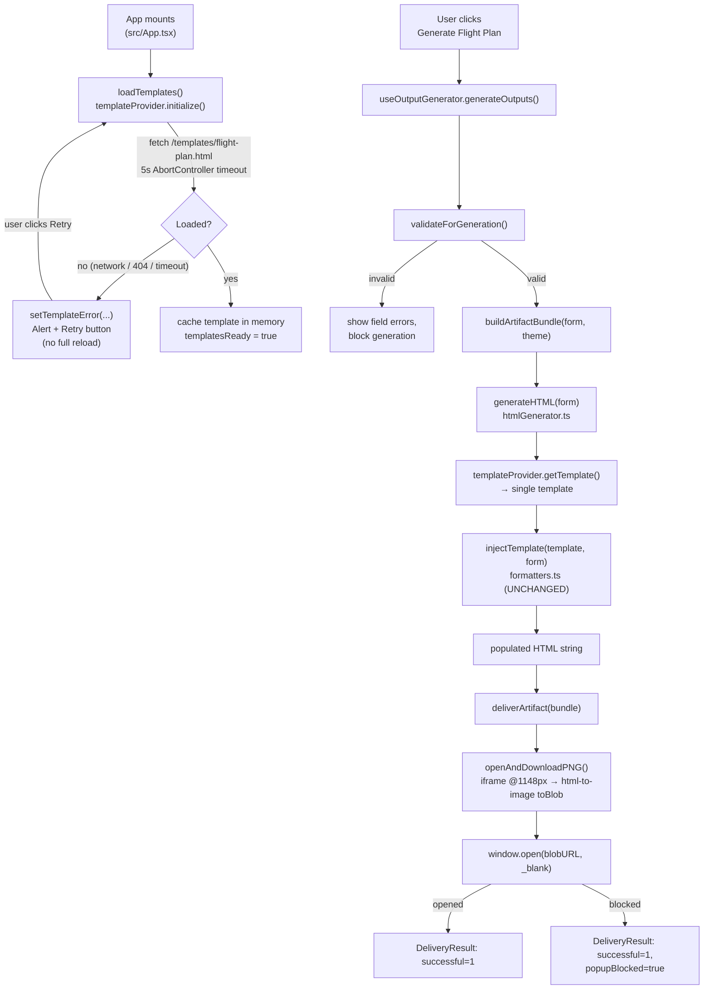

# Design Document

## Overview

TOWER's "Generate Flight Plan" action injects deployment form data into an authored HTML template and rasterizes the result to a PNG that opens in a new browser tab. The project currently ships two authored templates (`public/templates/light-mode.html` and `public/templates/dark-mode.html`), both of which load the Inter web font from a remote CDN (`rsms.me`), embed a base64 Southwest heart logo and a Crew Training logo, and are selected through a `Theme`→template mapping. The portal UI is dark-mode only, so the light template and the theme mapping are dead weight, and the remote font is unreliable during off-screen rasterization.

This redesign replaces both templates with a single, from-scratch dark HTML document — the **Flight Plan Template** — that matches the TOWER app chrome and the Southwest Jetstream (V5) palette. It preserves:

- the token-injection contract (`injectTemplate` in `src/utils/formatters.ts` is **unchanged**),
- every content field,
- the fixed 1100px card width inside a 1148px render container, and
- the existing rasterize-to-PNG + open-in-new-tab delivery behavior.

It retires the two old templates and the `Theme`→template mapping, and reconciles documentation. It introduces no new authentication, no new network surface, and no new backend dependency. This is a front-end template redesign plus a small plumbing simplification.

### Verified facts (from the current TOWER code)

The design below was checked against the actual source. Confirmed facts that shape it:

- **`injectTemplate`** (`src/utils/formatters.ts`) replaces, globally (`/g`): `{{NOTIFICATION_HEADER}}`, `{{DEPLOYMENT_TITLE}}`, `{{DEPLOYMENT_SUBTITLE}}`, `{{SCHEDULE}}`, `{{OUTAGE_INDICATOR}}`, `{{OUTAGE_BLOCK}}` (→ `''`), `{{JIRA_ITEMS}}`, `{{IMPACT_ITEMS}}` (→ `''`), `{{CONTACT}}`, and the legacy aliases `{{DEPLOYMENT_ID}}`, `{{DEPLOYMENT_SCHEDULE}}`, `{{OUTAGE_WINDOW}}` (→ `''`), `{{CHANGE_ITEMS}}`, `{{CONTACT_NAME}}`, `{{CONTACT_EMAIL}}`, `{{CONTACT_PHONE}}`. It does not need to change, so the new template must use these exact token names.
- **Change items markup** emitted by `renderChangeItems`: `<div class="change-group"><div><strong>{jira}</strong> {desc}</div>{impacts}</div>`, where impacts are `<div class="impact-sub" style="margin:4px 0 10px 18px;"><div>&bull; {text}</div>…</div>`. The template must style `.change-group`, `.impact-sub`, and `strong`. Note `.impact-sub` already carries an inline `margin`, so template CSS should set only color/spacing that does not fight it.
- **Contact block**: `injectTemplate` builds `name<br>email<br>phone` for `{{CONTACT}}`.
- **`templateProvider.ts`** currently keeps a `Map<'light'|'dark', string>` and fetches both files in parallel with a 5s `AbortController` timeout, throwing a timeout error that names the path; it resets `loadingPromise` on failure for retry, and caches on success.
- **Two `generateHTML` functions exist**: a synchronous one in `src/utils/htmlGenerator.ts` (used by `bundleBuilder.ts` → `useOutputGenerator`) and an async one in `src/utils/artifactGeneration.ts`. The delivery path actually used is: `useOutputGenerator` → `buildArtifactBundle` → `htmlGenerator.generateHTML` → `deliverArtifact` → `openAndDownloadPNG`. The async `artifactGeneration.generateHTML` is exported but not on the delivery path.
- **`openAndDownloadPNG`** (`src/utils/artifactGeneration.ts`) renders inside an **iframe** created with `iframeDoc.write(htmlString)`, sized `1148px`, then rasterizes `iframe.body` to a PNG blob via `html-to-image.toBlob` and `window.open`s the blob URL. The iframe is an isolated document — it does **not** inherit the parent page's loaded fonts. This is the key constraint for the font strategy.
- **`createRenderContainer`** (used by `generatePNG`, not the main delivery path) also fixes width to `1148px` and extracts `<style>` + `<body>`.
- **App chrome** (`src/App.tsx`): header uses MUI `FlightTakeoff` icon (imported as `AppIcon`) in `color="primary"` (SWA blue `rgb(25,130,230)`) next to a `fontWeight: 900` "TOWER" wordmark and the subtitle "Takeoff Notifications for Technology Deployments", on an app-bar surface `rgb(33,51,70)` with a `divider` bottom border. The Generate button is the single amber-yellow CTA.
- **Palette** (`src/theme/AppThemeProvider.tsx` `darkTokens`): bg `rgb(21,39,63)`, paper `rgb(33,51,70)`, paperElevated `rgb(43,61,79)`, surfaceHover `rgb(52,73,94)`, divider `rgb(71,99,128)`, primary blue `rgb(25,130,230)`, swaYellow `rgb(255,191,0)`, textPrimary white, textSecondary `rgb(207,217,219)`, textDisabled `rgb(123,139,144)`; `shape.borderRadius: 8`.
- **`index.html`** loads Open Sans from Google Fonts for the *app UI only*. The template must not depend on that (it renders in an isolated iframe and must reference no remote font).
- **Vite** config is default (`@vitejs/plugin-react`); `public/` is copied verbatim into `dist/` on build, so `public/templates/*.html` → `dist/templates/*.html` with no extra config.
- **No test framework** is configured: `package.json` has no `test` script and no Vitest/Jest/Playwright runner dependency installed for unit tests. Test updates in this design are therefore conditional/optional (see Testing Strategy).

## Architecture

### End-to-end flow



Load → inject → rasterize → deliver all stay in place. The only structural change is that `getTemplate()` returns one template unconditionally rather than selecting by theme.

### Module touchpoints

| Module | Change |
|--------|--------|
| `public/templates/flight-plan.html` | **New** single authored template (replaces both old files). |
| `public/templates/light-mode.html`, `public/templates/dark-mode.html` | **Deleted.** |
| `src/utils/templateProvider.ts` | Collapse `Map<Theme,string>` to a single cached string; fetch one path; keep 5s timeout + retry reset + cache; `getTemplate()` takes no theme (or ignores it). |
| `src/utils/htmlGenerator.ts` | `generateHTML(data, theme?)` keeps signature for back-compat; drops `mapThemeToTemplate`; calls `getTemplate()` unconditionally. |
| `src/utils/artifactGeneration.ts` | Async `generateHTML(data, theme?)` keeps signature; drops the `themeKey` branch; selects the single template. Delivery functions unchanged. |
| `src/utils/bundleBuilder.ts` | No logic change; still passes `theme` through (now ignored downstream). Signature kept. |
| `src/hooks/useOutputGenerator.ts` | No change; still forwards `theme` (now ignored). |
| `src/App.tsx` | No functional change; `theme = 'Dark Mode'` constant and `loadTemplates()` retry UI stay. |
| `docs/*.md`, `src/theme/README.md` | Reconcile references to the two templates / theme mapping. |

## Components and Interfaces

### 1. Flight Plan Template — `public/templates/flight-plan.html`

**Filename decision.** Use **`flight-plan.html`**, not a reused `dark-mode.html`.

- *Justification:* We are already collapsing the loader to a single template and deleting both old files, so "minimize loader changes" by reusing `dark-mode.html` buys nothing — the loader is being rewritten regardless. A name that states the artifact's identity (the Flight Plan) is clearer for maintainers, removes the misleading "dark vs light" implication, and makes stale-reference grepping unambiguous after the two old names are retired. The one-line cost is updating the single fetch path in `templateProvider.ts` and the example path in `docs/DEPLOYMENT.md`.

**Document structure** (full HTML document — `<!DOCTYPE html>`, `<html>`, `<head>`, inline `<style>`, `<body>`):

```html
<!DOCTYPE html>
<html lang="en">
  <head>
    <meta charset="UTF-8" />
    <meta name="viewport" content="width=device-width, initial-scale=1.0" />
    <title>{{NOTIFICATION_HEADER}} — Flight Plan</title>
    <style> /* fully inline, see Styling */ </style>
  </head>
  <body>
    <div class="page">
      <div class="card">
        <div class="stripe"></div>                     <!-- SWA red #e31837 accent stripe -->
        <header class="card-header">
          <span class="brand-icon"><svg>…takeoff icon…</svg></span>
          <div class="brand-text">
            <div class="wordmark">TOWER</div>
            <div class="tagline">Takeoff Notifications for Technology Deployments</div>
          </div>
          <!-- NO heart logo, NO Crew Training logo -->
        </header>

        <div class="notice-header">{{NOTIFICATION_HEADER}}</div>

        <table class="fields">
          <tr><th>Deployment</th><td>
            <div class="title">{{DEPLOYMENT_TITLE}}</div>
            <div class="subtitle">{{DEPLOYMENT_SUBTITLE}}</div>
          </td></tr>
          <tr><th>Schedule</th><td>{{SCHEDULE}}</td></tr>
          <tr><th>Outage</th><td><span class="outage-pill">{{OUTAGE_INDICATOR}}</span></td></tr>
          <tr><th>Changes</th><td class="changes">{{JIRA_ITEMS}}</td></tr>
          <tr><th>Contact</th><td>{{CONTACT}}</td></tr>
        </table>

        <!-- Always-emptied / legacy tokens kept so injectTemplate stays unchanged.
             They inject to '' and leave no visible region or placeholder text. -->
        <div class="hidden-tokens" style="display:none">
          {{OUTAGE_BLOCK}}{{IMPACT_ITEMS}}{{OUTAGE_WINDOW}}
        </div>
      </div>
    </div>
  </body>
</html>
```

**Token coverage.** Every Content_Token appears exactly where its data belongs: `{{NOTIFICATION_HEADER}}`, `{{DEPLOYMENT_TITLE}}`, `{{DEPLOYMENT_SUBTITLE}}`, `{{SCHEDULE}}`, `{{OUTAGE_INDICATOR}}`, `{{JIRA_ITEMS}}`, `{{CONTACT}}`. The always-emptied tokens `{{OUTAGE_BLOCK}}` and `{{IMPACT_ITEMS}}`, plus the legacy alias `{{OUTAGE_WINDOW}}`, are placed inside a `display:none` holder so `injectTemplate` finds and clears them to `''` with no visible output. The remaining legacy aliases (`{{DEPLOYMENT_ID}}`, `{{DEPLOYMENT_SCHEDULE}}`, `{{CHANGE_ITEMS}}`, `{{CONTACT_NAME}}`, `{{CONTACT_EMAIL}}`, `{{CONTACT_PHONE}}`) are not authored into the template; `injectTemplate` simply finds no occurrences and makes no replacement, which is correct (it never injects raw placeholder text). The injector is therefore **unchanged**.

**Header branding.** TOWER wordmark + an inline-SVG takeoff icon (mirroring the app's MUI `FlightTakeoff`) + the SWA brand accent. The accent is the red `#e31837` top stripe plus the SWA-blue icon, matching the app header. No Southwest heart logo and no Crew Training logo — neither as `` nor as a base64 data URI (the old `dark-mode.html` embedded a heart PNG; it is not carried over).

**`{{JIRA_ITEMS}}` styling.** The template defines rules for the exact markup the injector emits:

```css
.changes .change-group { margin-bottom: 12px; }
.changes .change-group:last-child { margin-bottom: 0; }
.changes strong { color: rgb(25, 130, 230); font-weight: 700; }  /* SWA blue Jira number */
.changes .impact-sub { color: rgb(207, 217, 219); font-size: 14px; }
.changes .impact-sub div { margin: 2px 0; }
```

`.impact-sub` keeps the injector's inline `margin:4px 0 10px 18px;`; template CSS only adds color/size so it does not conflict.

### 2. Styling (inline `<style>`)

All CSS lives in one inline `<style>`; no external CSS and no external JS. Exact Jetstream values:

```css
:root {
  --bg:        rgb(21, 39, 63);   /* page background */
  --card:      rgb(33, 51, 70);   /* card surface */
  --elevated:  rgb(43, 61, 79);   /* raised regions: header row cells, outage pill */
  --divider:   rgb(71, 99, 128);  /* divider lines between field rows */
  --text:      rgb(255, 255, 255);/* primary text */
  --text-2:    rgb(207, 217, 219);/* secondary text */
  --text-3:    rgb(123, 139, 144);/* tertiary text (tagline, labels) */
  --blue:      rgb(25, 130, 230);  /* SWA blue — primary accent, icon, Jira numbers, th labels */
  --amber:     rgb(255, 191, 0);   /* reserved for ONE accent only (outage=Yes pill) */
  --stripe:    #e31837;            /* SWA red top stripe */
}
body { margin: 0; background: var(--bg); color: var(--text);
       font-family: 'Open Sans', -apple-system, BlinkMacSystemFont, 'Segoe UI', sans-serif; }
.page { padding: 24px; }                 /* 24px each side → 1100 + 48 = 1148px container */
.card { width: 1100px; margin: 0 auto; background: var(--card);
        border-radius: 8px; overflow: hidden; }
.stripe { height: 6px; background: var(--stripe); }
.fields { width: 100%; border-collapse: collapse; }
.fields th { width: 160px; text-align: left; color: var(--blue);
             background: var(--elevated); border-bottom: 1px solid var(--divider);
             padding: 12px 16px; vertical-align: top; font-size: 14px; }
.fields td { border-bottom: 1px solid var(--divider); padding: 12px 16px;
             color: var(--text-2); font-size: 15px; line-height: 1.5; }
```

Design-rule mapping: card radius **8px** (Req 2.7); 1100px card + 24px/side = **1148px** (Req 6.1–6.2); fields-and-table layout with divider lines, **no** perforations/stubs/barcodes (Req 2.8). Amber `rgb(255,191,0)` is used for **at most one** element — the "Yes" outage pill — consistent with the app's single-CTA convention (Req 2.6).

**Contrast (Req 2.9).** Body text on the card surface `rgb(33,51,70)` must be ≥ 4.5:1. Primary white and secondary `rgb(207,217,219)` on this surface both clear 4.5:1 comfortably; tertiary `rgb(123,139,144)` is reserved for large/decorative text (tagline, labels on the elevated `rgb(43,61,79)` header cell) and is not used for body copy. This mirrors the WCAG-AA posture the app theme already documents.

### 3. Font strategy — reliable Open Sans without a remote resource

**Problem.** The delivery path (`openAndDownloadPNG`) renders the template inside a freshly written **iframe** document. An iframe document does not inherit the parent page's Google-Fonts-loaded Open Sans, and the template must reference no remote font (Req 5.2, 5.4). If nothing is embedded, Open Sans is available only when the OS happens to have it installed; otherwise `html-to-image` rasterizes with whatever the browser falls back to.

**Chosen approach — embed Open Sans as a base64 `@font-face` inside the inline `<style>`:**

```css
@font-face {
  font-family: 'Open Sans';
  font-style: normal;
  font-weight: 400;
  src: url(data:font/woff2;base64,<…subset…>) format('woff2');
}
/* repeat for 600 and 700 (the weights the template uses) */
```

- The `src` uses a `data:` URI only — no network request at render time, satisfying Req 5.5 ("WHERE font data is included … embed that font data within the document").
- Embed only the weights the design uses (400 body, 600 labels/subtitles, 700 wordmark/Jira numbers) as a Latin subset to keep the file small; the base64 payload is pasted into the authored HTML.
- `font-family` on `body` declares `'Open Sans'` first, then the exact system fallback stack `-apple-system, BlinkMacSystemFont, 'Segoe UI', sans-serif` (Req 5.3).

**Sourcing the woff2.** TOWER does not currently bundle Open Sans locally (no `@fontsource` package, no `public` font file — verified). The embedded base64 is produced once from an Open Sans woff2 (e.g. the Apache-2.0-licensed Google Fonts Open Sans files) and committed inside the template. Because it is inlined, no build wiring, asset path, or package dependency is added.

**Fallback behavior (Req 5.6).** If the embedded `@font-face` ever fails to decode or is removed, the browser resolves `font-family` to the next entry — the system stack `-apple-system, BlinkMacSystemFont, 'Segoe UI', sans-serif`. Rendering still succeeds; only the glyph shapes change. No layout depends on Open Sans metrics specifically (sizes are in px, not font-relative units for the card width), so the framed PNG stays correctly sized.

*Alternative considered and rejected:* keeping the remote Google/`rsms.me` `<link>` — rejected because it violates Req 5.2/5.4 and is exactly the unreliable-during-rasterization behavior this feature removes.

### 4. Template loader — `src/utils/templateProvider.ts`

Collapse to a single cached template. Proposed shape (preserving the 5s timeout, retry-on-failure reset, and cache):

```typescript
const TEMPLATE_PATH = '/templates/flight-plan.html';

class TemplateProvider {
  private template: string | null = null;
  private loadingPromise: Promise<void> | null = null;

  async initialize(): Promise<void> {
    if (this.template !== null) return;             // cached (Req 9.4)
    if (this.loadingPromise) return this.loadingPromise;
    this.loadingPromise = this.loadTemplate().catch((err) => {
      this.loadingPromise = null;                   // reset so retry works (Req 9.3)
      throw err;
    });
    return this.loadingPromise;
  }

  getTemplate(): string {                           // no theme param (Req 8.3)
    if (this.template === null) {
      throw new Error('Template not loaded. Call initialize() first.');
    }
    return this.template;
  }

  isLoaded(): boolean { return this.template !== null; }

  private async loadTemplate(): Promise<void> {
    this.template = await this.loadTemplateAsync(TEMPLATE_PATH);
  }

  private async loadTemplateAsync(path: string): Promise<string> {
    const controller = new AbortController();
    const timeout = setTimeout(() => controller.abort(), 5000);   // Req 9.2
    try {
      const response = await fetch(path, { signal: controller.signal });
      if (!response.ok) throw new Error(`Failed to load template from ${path}: ${response.status}`);
      return await response.text();
    } catch (err) {
      if (controller.signal.aborted) {
        throw new Error(`Timed out loading template from ${path} after 5000ms`);  // names path
      }
      throw err;
    } finally {
      clearTimeout(timeout);
    }
  }

  setTemplate(template: string): void { this.template = template; }
  clear(): void { this.template = null; this.loadingPromise = null; }
}
```

The exported `Theme = 'light' | 'dark'` type is removed from this module (nothing else should depend on it). `getTemplate()` signature changes from `getTemplate(theme)` to `getTemplate()`.

**Backward-compatibility choice.** `getTemplate` must drop its required `theme` argument because the Map it indexed no longer exists; callers (`htmlGenerator.ts`, `artifactGeneration.ts`) are updated in the same change. This is an internal API, so there is no external contract to preserve.

### 5. HTML generators

**`src/utils/htmlGenerator.ts`** (delivery path, synchronous):

```typescript
export function generateHTML(data: DeploymentFormData, _theme?: Theme): string {
  const template = templateProvider.getTemplate();   // no branching on theme (Req 8.3, 1.4)
  return injectTemplate(template, data);
}
```

Keep the `(data, theme?)` signature so `bundleBuilder.ts` and `useOutputGenerator.ts` need no change; the `theme` argument becomes unused. Delete `mapThemeToTemplate`.

**`src/utils/artifactGeneration.ts`** (async `generateHTML`, off the delivery path but exported):

```typescript
export async function generateHTML(data: DeploymentFormData, _theme?: Theme): Promise<string> {
  if (!templateProvider.isLoaded()) await templateProvider.initialize();
  return injectTemplate(templateProvider.getTemplate(), data);
}
```

Drop the `themeKey` branch; keep the signature. `generatePNG`, `openAndDownloadPNG`, `openHTMLTab`, and the 1148px container sizing are **unchanged**.

**`src/utils/bundleBuilder.ts`** and **`src/hooks/useOutputGenerator.ts`**: no logic change. They continue to thread `theme` through for signature stability; it is simply ignored downstream. `App.tsx` continues to pass the `'Dark Mode'` constant.

### 6. Build and cleanup

- **Delete** `public/templates/light-mode.html` and `public/templates/dark-mode.html` (Req 8.1).
- **Add** `public/templates/flight-plan.html`.
- No Vite change is required: `public/` is copied verbatim into `dist/`, so `public/templates/flight-plan.html` → `dist/templates/flight-plan.html`, retrievable at `/templates/flight-plan.html` (Req 8.5). After the change, `dist/templates/` should contain exactly the one file.

## Data Models

The injector contract is fixed by `src/utils/formatters.ts` and is **not** modified. The template must satisfy it:

| Token | Source value | Injected as | Template placement |
|-------|--------------|-------------|--------------------|
| `{{NOTIFICATION_HEADER}}` | `generateNotificationHeader(app, env, pi)` | text | `.notice-header` |
| `{{DEPLOYMENT_TITLE}}` | `generateDeploymentTitle(data)` (`CHG##### — App`) | text | Deployment row `.title` |
| `{{DEPLOYMENT_SUBTITLE}}` | escaped `formatChangeNumber` (`CHG#####`) | escaped text | Deployment row `.subtitle` |
| `{{SCHEDULE}}` | `formatSchedule(start, end)` | text | Schedule row |
| `{{OUTAGE_INDICATOR}}` | `renderOutageIndicator` → `Yes`/`No` | text | Outage row `.outage-pill` |
| `{{JIRA_ITEMS}}` | `renderChangeItems(data.changeItems)` | HTML (`.change-group`/`.impact-sub`/`strong`) | Changes row |
| `{{CONTACT}}` | `name<br>email<br>phone` (escaped parts) | HTML | Contact row |
| `{{OUTAGE_BLOCK}}` | always `''` | empty | hidden holder |
| `{{IMPACT_ITEMS}}` | always `''` | empty | hidden holder |
| `{{OUTAGE_WINDOW}}` (legacy) | always `''` | empty | hidden holder |
| `{{DEPLOYMENT_ID}}`, `{{DEPLOYMENT_SCHEDULE}}`, `{{CHANGE_ITEMS}}`, `{{CONTACT_NAME}}`, `{{CONTACT_EMAIL}}`, `{{CONTACT_PHONE}}` (legacy) | replaced if present | — | not authored (safe no-op) |

Text tokens are HTML-escaped by the injector; HTML tokens (`{{JIRA_ITEMS}}`, `{{CONTACT}}`) are inserted verbatim because their component parts are already escaped. The template adds no new tokens.

## Error Handling

| Condition | Handling | Requirement |
|-----------|----------|-------------|
| Template fetch exceeds 5s | `AbortController` aborts; loader throws a timeout error naming the path. | 9.2 |
| Network error / 404 / timeout | `initialize()` rejects and resets `loadingPromise`; `App.tsx` catches, sets `templateError`, renders an `Alert` with a **Retry** button that re-invokes `loadTemplates()` — an in-page React state transition, no full reload. | 9.3 |
| Successful load | Template cached in memory; repeated `initialize()` is a no-op; `templatesReady = true`. | 9.4 |
| `getTemplate()` before load | Throws a clear "not loaded, call initialize() first" error. | — |
| Empty token value | Injector replaces with `''`; the hidden holder / omitted region shows no raw `{{TOKEN}}` text. | 4.6 |
| PNG rasterization fails | `deliverArtifact` records `failed++` with a descriptive error; nothing opens. | 7 (13.4) |
| New tab blocked | `openAndDownloadPNG` returns `false`; `deliverArtifact` still counts `successful++` and sets `popupBlocked = true`. | 7.5 |

## Correctness Properties

*A property is a characteristic or behavior that should hold true across all valid executions of a system — essentially, a formal statement about what the system should do. Properties serve as the bridge between human-readable specifications and machine-verifiable correctness guarantees.*

Prework classified most acceptance criteria as EXAMPLE/SMOKE (static CSS values, file presence, structural markup, build copy) or INTEGRATION (third-party rasterization and `window.open`). Those are not universally-quantified properties and are covered by inspection, snapshot, or single-example checks. The criteria that test TOWER's own input-varying logic yield the properties below. Redundancy reflection: the theme-independence criteria (1.3, 1.4, 8.3, 8.4) collapse into one property; the "no raw placeholder" aspects of 4.4/4.5/4.6 collapse into one property distinct from the "every value appears" property (4.2); the loader caching (9.4) and recoverability (9.3) are separate, non-overlapping invariants.

### Property 1: Theme-independent template selection

*For any* deployment form data and *for any* theme value supplied by the caller (including `'Light Mode'`, `'Dark Mode'`, or none), `generateHTML` SHALL produce output derived from the single Flight Plan Template — i.e. the token-stripped HTML skeleton is identical regardless of the theme argument.

**Validates: Requirements 1.3, 1.4, 8.3, 8.4**

### Property 2: Every content value is rendered

*For any* valid `DeploymentFormData`, after `injectTemplate` populates the Flight Plan Template, the rendered HTML SHALL contain the notification header, the deployment title, the change-number subtitle, the formatted schedule, the Yes/No outage indicator, each change item's Jira number and description with its nested impact bullets, and the contact block.

**Validates: Requirements 4.2**

### Property 3: No token or placeholder survives injection

*For any* `DeploymentFormData` (including data with empty fields, no change items, or no impacts), the populated HTML SHALL contain none of the Content_Token or Legacy_Alias placeholder strings and SHALL contain no residual `{{…}}` placeholder text; the always-emptied tokens `{{OUTAGE_BLOCK}}` and `{{IMPACT_ITEMS}}` SHALL contribute no visible content.

**Validates: Requirements 4.4, 4.5, 4.6**

### Property 4: Successful load is cached (idempotence)

*For any* number of `initialize()` calls after a first successful load, the loader SHALL perform exactly one network fetch and `getTemplate()` SHALL return the same cached template content on every call.

**Validates: Requirements 9.4**

### Property 5: Load failure is always recoverable

*For any* sequence of fetch outcomes in which a load attempt fails (network error, missing file, or timeout) and a later attempt would succeed, invoking `initialize()` again after a failure SHALL start a fresh attempt and resolve successfully — the provider is never left permanently wedged and requires no full page reload.

**Validates: Requirements 9.3**

## Testing Strategy

**Current reality: TOWER has no test tooling.** `package.json` defines no `test` script and installs no unit-test runner (no Vitest/Jest) or Playwright runner. This design therefore does **not** introduce test infrastructure, and all test work is **conditional/optional** — to be done only if and when a runner is added. Requirement 10.3 is conditional for the same reason: there are no automated tests referencing the retired filenames or the theme mapping to update.

If a test runner is later introduced, the following would be the natural coverage, consistent with the classifications above:

- **Property tests** (Properties 1–5): pure-logic checks over generated `DeploymentFormData` and theme values using a property library (e.g. `fast-check`), each tagged `Feature: flight-plan-redesign, Property N: …`, ≥100 iterations. Properties 1–3 exercise `generateHTML` + `injectTemplate` against the authored template; Properties 4–5 exercise `templateProvider` with a stubbed `fetch` and fake timers.
- **Example / snapshot checks** (static criteria): assert the single template exists, the inline `<style>` carries the required palette values, radius, and widths, the header has the wordmark + inline SVG icon and no logo data URIs, the `.change-group`/`.impact-sub`/`strong` rules exist, and that no remote font or external CSS/JS reference remains.
- **Integration / smoke** (rasterization, new-tab, build copy): one representative render producing a PNG blob with `window.open` stubbed, including the popup-blocked branch; and a post-build check that `dist/templates/flight-plan.html` exists and the two old files do not.

Until a runner exists, these are verified manually: run `npm run build` and confirm `dist/templates/` contains only `flight-plan.html`, then generate a Flight Plan in the browser and confirm the PNG opens in a new tab with correct fonts and all fields populated.

**Documentation reconciliation (Req 10.1, 10.2).** Update references to the two templates / theme mapping in:

- `docs/REPOSITORY_CLEANUP_SUMMARY.md` — the `public/templates/` tree listing and the "Templates Copied: Both light-mode.html and dark-mode.html" build note.
- `docs/DEVELOPER_GUIDE.md` — the `public/templates/` tree (`light-mode.html` / `dark-mode.html`), and the theme-selection / e2e "Select Dark/Light theme" references.
- `docs/DEPLOYMENT.md` — the example asset path `/templates/light-mode.html` → `/templates/flight-plan.html`.
- `docs/ARCHITECTURE.md` — the `generateHTML(data, theme)` description and `templateProvider.getTemplate()` theme-selection narrative, plus `/public/templates/*.html` references.
- `src/theme/README.md` — the Light/Dark artifact-template narrative, the "Generated Artifacts" theme-selection flow, and the `/public/templates/*.html` reference, revised to describe the single Flight Plan Template.
